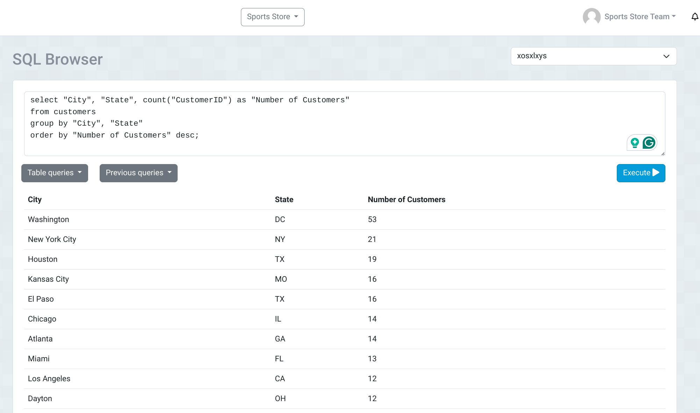
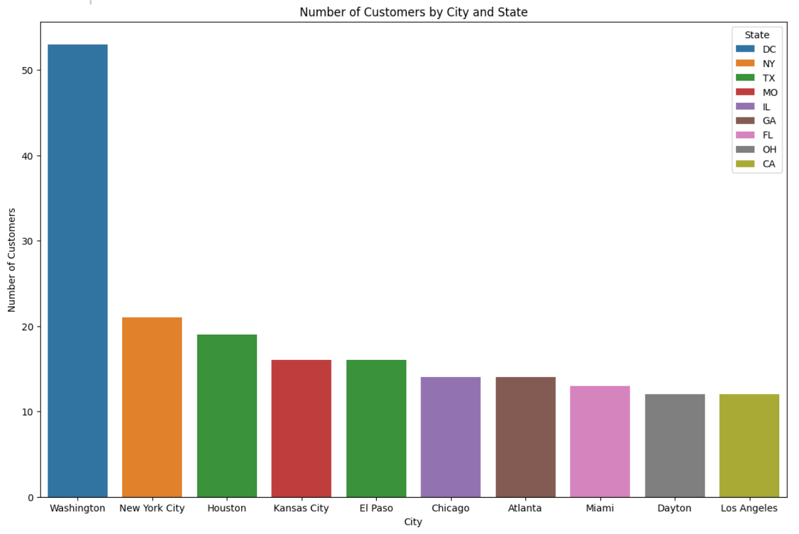
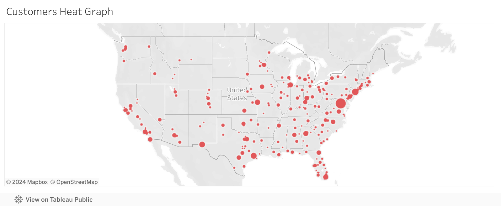
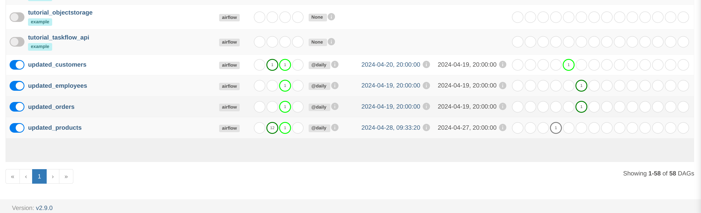
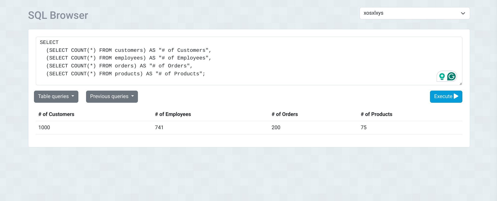

## Summary
A mock store selling sports equipment requires data-driven help in figuring out where to open their new branch.

The store wants to open the new brach in the city, and state where most of their customers live. 

I've downloaded four datasets in excel forms respresenting data from the stores customers, employees, products, and orders made. 

> [!IMPORTANT]
> Jupyter Notebook was used in testing python code line by line prior to creating DAGs in Apache Airflow

- Pandas (the Python library) was used to import, work with, and transform the raw data; cleaning, standardizing, removing duplicates, etc.
- A PostgreSQL database on ElephantSQL is used to create, read, update, and delete data from the web browser.
- SQLAlchemy (the Python Library) was used to connect and interact with our database.
- Seaborn was used to vizualize the data from the database.
- Apache Airflow was used to automate our ETL.
- Tableau Public was used to create the heat map of all customers in the United States. 

Querying the database allowed me to see where the majority of Sport Store's customers live.

Based off of the data, the majority of Sport Store's customers live in Washington DC. 

This graph can be added to the dashboard to show the amount of customers in the top 10 cities.

This heat map can be added to the dashboard to show the amount of total customers in the United States.

> [!WARNING]
> The heat map is about 90% accurate, but it still provides a reasonable approximation to aid in decision making. 

### Based off the data, Sports Store should build their next branch in Washington DC!

Apache Airflow DAGs were created to automate updating the data wearhouse for the companies orders, products, customers, and employees.

The remaining 3 databased were automatically uploaded to the data wearhouse via Apache Airflow

## Bugs and Solutions

### Bug 1
- <ins>Bug</ins>: Extracting the raw data via pandas threw and error
- <ins>Solution</ins>: Python was missing the openpyxl package; `pip install openpyxl`

### Bug 2
- <ins>Bug</ins>: Creating a new engine with SQLAlchemy threw and error
    - <ins>Bug 2b</ins>: Attempting to install the missing psycopg2 package, `pip install psycopg2`, threw another error. This is because psycopg2 requires pg_config from the PostgreSQL development files to be installed in my system.
- <ins>Solution</ins>: Install the binary package psycopg2-binary which does not require compiling; `pip install psycopg2-binary`